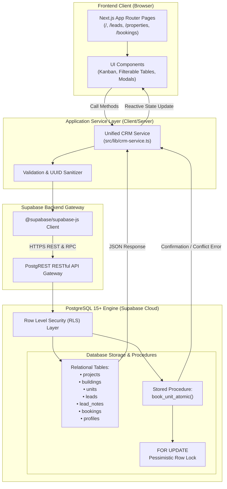
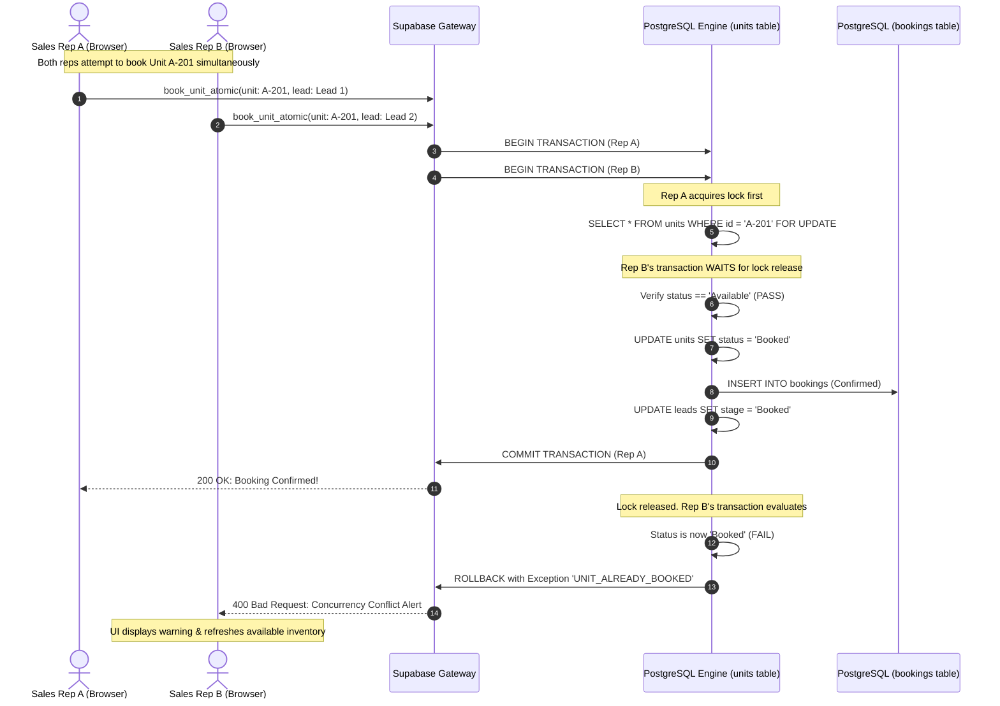
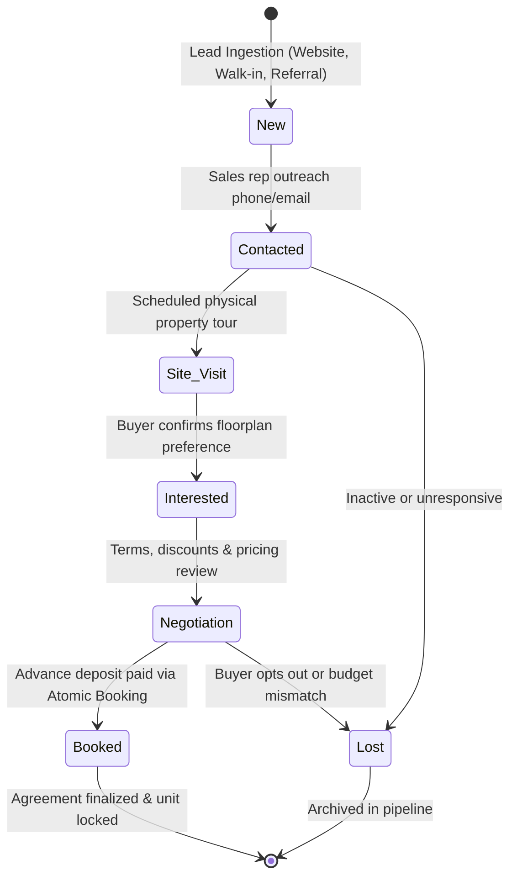
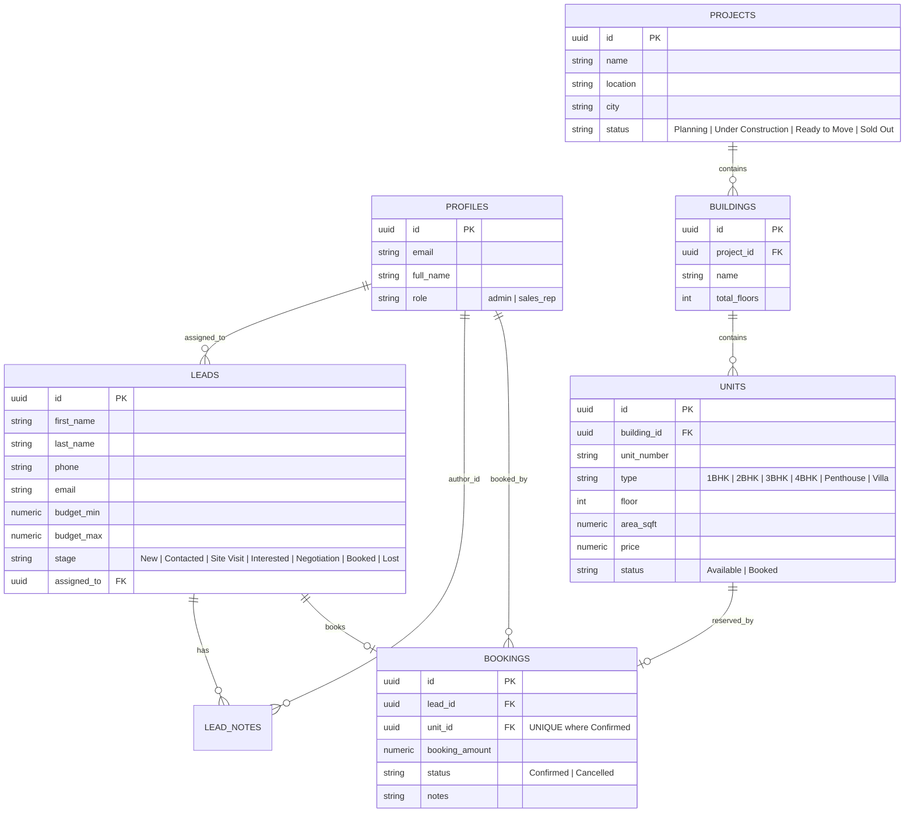

# EstateFlow — Enterprise Real Estate CRM

An end-to-end Real Estate CRM application engineered for sales teams to manage prospective buyers through a 7-stage pipeline, navigate hierarchical property inventories (Projects → Buildings → Units), and execute conflict-free unit bookings with **strict database-level concurrency protection** and **Role-Based Access Control (Admin vs. Sales Employee)**.

Built with **Next.js (App Router, Turbopack, TypeScript)**, **Tailwind CSS v4**, and **Supabase (PostgreSQL 15+, Row-Level Security, RPC Stored Procedures)**.

---

## Live Deployment & Repository

- **Live Deployed Application**: [https://estateflow-crm.netlify.app](https://estateflow-crm.netlify.app) *(or your deployed Netlify URL)*
- **GitHub Repository**: [https://github.com/Arumuga-Raja-p/real_estate_crm](https://github.com/Arumuga-Raja-p/real_estate_crm)

---

## Technology Stack

| Layer | Technologies | Role & Architectural Purpose |
| :--- | :--- | :--- |
| **Frontend Framework** | **Next.js 16 (App Router, Turbopack)** | Server/Client hybrid architecture, fast Turbopack compilation, and modern routing. |
| **UI Library & Language** | **React 19 & TypeScript 5** | Strict type safety across leads, property units, bookings, and database responses. |
| **Styling & Design System** | **Tailwind CSS v4 & Lucide Icons** | Design tokens, glassmorphism headers, Poppins typography, dark/light theme switching. |
| **UI Primitives** | **Base UI (`@base-ui/react`) & Sonner** | Accessible headless select, dialogs, and toast notifications for user interactions. |
| **Cloud Database** | **Supabase (PostgreSQL 15+)** | Relational data integrity, Foreign Keys, cascading deletes, and connection pooling. |
| **API & Data Access** | **Supabase PostgREST & `@supabase/ssr`** | Auto-generated REST APIs, type-safe RPC stored procedure executions, and real-time queries. |
| **Deployment Platform** | **Netlify** | CI/CD Git-integrated production hosting with Next.js Runtime (`@netlify/plugin-nextjs`). |

---

## System Architecture & Data Flow



---

## How the Backend & Database Interact

The backend leverages a **Service-Oriented Architecture** via `crmService` ([`src/lib/crm-service.ts`](file:///d:/Realstate%20CRM/src/lib/crm-service.ts)):

1. **Client Initialization**: A browser-safe client is instantiated using `@supabase/ssr` and `.env.local` credentials (`NEXT_PUBLIC_SUPABASE_URL` and `NEXT_PUBLIC_SUPABASE_ANON_KEY`).
2. **Relational Joins (No N+1 Queries)**: Complex hierarchies are queried in a single round-trip using Supabase's foreign key syntax:
   ```typescript
   const { data } = await supabase
     .from('units')
     .select('*, building:buildings(*, project:projects(*))')
     .order('unit_number');
   ```
3. **Input Sanitization & Type Coercion**: Before executing write operations, data payloads pass through UUID regex validation to ensure foreign keys (`assigned_to`, `building_id`, `lead_id`) never trigger PostgreSQL cast exceptions.
4. **Zero-Config Resilient Fallback**: If cloud connectivity is temporarily offline, `crmService` automatically falls back to an in-memory reactive store, ensuring uninterrupted demo and evaluation sessions.

---

## Concurrency Protection Flow (`FOR UPDATE` Row Locking)

To satisfy the critical requirement of **preventing two sales reps from double-booking the same unit**, EstateFlow implements an atomic PostgreSQL function (`book_unit_atomic`) utilizing pessimistic row locking.



---

## 7-Stage Lead Pipeline Lifecycle



---

## 5 Important Architectural & Engineering Decisions

### 1. Atomic Concurrency Control with PostgreSQL Row-Level Locking (`FOR UPDATE`)
* **The Problem:** In fast-moving real estate sales environments, multiple agents can attempt to book the identical apartment simultaneously during high-demand project launches. Client-side checks alone result in double-booking race conditions.
* **Our Solution:** We implemented an atomic stored procedure (`book_unit_atomic`) in `supabase/migrations/001_initial_schema.sql` executing `SELECT ... FOR UPDATE`. This guarantees ACID transactional isolation. In addition, a PostgreSQL partial unique index (`CREATE UNIQUE INDEX idx_unique_confirmed_unit_booking ON bookings (unit_id) WHERE status = 'Confirmed'`) serves as an engine-level safeguard.
* **Interactive Proof:** The application includes a built-in **"Simulate Concurrency Collision"** modal that fires parallel requests for the same unit, visibly proving that one succeeds while the second is safely rejected.

### 2. Dual-View Lead Pipeline (Kanban Board + Filterable Table)
* **The Decision:** Built a real-time toggle between an interactive **7-Stage Kanban Funnel** and an operational **Tabular View**.
* **Why:** Field sales reps need drag-and-drop Kanban columns for quick status advancement during phone calls, while sales managers need tabular views for bulk filtering by budget, sales agent, and acquisition source.

### 3. Database-Enforced Role-Based Access Control (Supabase RLS)
* **The Decision:** Implemented PostgreSQL Row Level Security (RLS) policies directly on database tables rather than relying solely on client-side conditionals.
* **Why:** In real estate teams, sales reps should only manage their assigned accounts, while Admins require organizational visibility. Database-level RLS prevents unauthorized data access even if API endpoints are accessed directly.

### 4. Hierarchical Property Inventory Model (`Projects` → `Buildings` → `Units`)
* **The Decision:** Organized property inventory into a 3-tier normalized relational schema:
  - `projects`: Master developments (*The Grand Horizon*)
  - `buildings`: Towers/phases (*Tower A - Azure*)
  - `units`: Specific sellable units with bedroom configurations (`1BHK`, `2BHK`, `3BHK`, `Penthouse`, `Villa`), floor number, area in sqft, price, and real-time status.
* **Why:** Mirroring physical developments enables realistic floor-by-floor matrix navigation, building-level filtering, and accurate token calculations.

### 5. Automated Lead Audit Trail & Integrated Follow-Up Scheduling
* **The Decision:** Every milestone (deal stage changes, notes, bookings) automatically generates an audit record in `lead_notes` with author attribution and optional follow-up alerts.
* **Why:** Real estate buying cycles span weeks to months. Linking follow-up reminders directly to the Executive Dashboard ensures prospects are never dropped by sales reps.

---

## Database Entity-Relationship Diagram (ERD)



---

## Local Setup & Installation

### Prerequisites
- **Node.js**: v18+ (tested on v20 and v24)
- **npm**: v9+

### 1. Clone & Install Dependencies
```bash
git clone https://github.com/Arumuga-Raja-p/real_estate_crm.git
cd real_estate_crm
npm install
```

### 2. Configure Environment Variables
Create a `.env.local` file in the root directory:
```bash
cp .env.example .env.local
```
Configure your Supabase credentials:
```env
NEXT_PUBLIC_SUPABASE_URL=XXXXXXXXXXXXXXXXXXXXXXXXXXXXXXX
NEXT_PUBLIC_SUPABASE_ANON_KEY=XXXXXXXXXXXXXXXXXXXXXXXXXXX
```

### 3. Database Migration (Supabase SQL Editor)
Run the SQL scripts in order:
1. `supabase/migrations/001_initial_schema.sql` (Tables, RLS, `book_unit_atomic` RPC)
2. `supabase/migrations/002_allow_anon_access.sql` (Public RLS access for client apps)
3. `supabase/seed.sql` (Realistic sample projects, towers, units, and leads)

### 4. Run Development Server
```bash
npm run dev
```
Open [http://localhost:3000](http://localhost:3000) in your browser.

---

## Netlify Deployment Guide

This repository includes a [`netlify.toml`](file:///d:/Realstate%20CRM/netlify.toml) pre-configured for the Next.js runtime.

1. Push your code to GitHub:
   ```bash
   git add .
   git commit -m "feat: complete Real Estate CRM"
   git push origin main
   ```
2. In [Netlify](https://app.netlify.com), select **"Add new site"** → **"Import an existing project"** → **GitHub**.
3. Choose your repository.
4. Under **Environment variables**, add:
   - `NEXT_PUBLIC_SUPABASE_URL`
   - `NEXT_PUBLIC_SUPABASE_ANON_KEY`
5. Click **"Deploy Site"**.

---

## Testing Scenarios

1. **Lead Management & Notes**:
   - Go to `/leads` → Click **"Add Lead"** → Enter details.
   - Click on the lead → View details → Add a note with tomorrow's follow-up date.
   - Return to `/` (Dashboard) → Verify the reminder appears under **Scheduled Follow-Ups**.
2. **Property Exploration & Booking**:
   - Go to `/properties` → Filter by Project (*The Grand Horizon*) or Unit Type (*3BHK*).
   - Click **"Book Unit"** → Select a customer → Enter token amount → Confirm.
   - Verify the unit switches to **"Booked"** and the lead transitions to **"Booked"** stage.
   - Check `/bookings` for the recorded transaction audit trail.
3. **Double-Booking Concurrency Test**:
   - Click **"Simulate Concurrency Collision"** in the top navbar.
   - Run the simulation to observe two concurrent booking attempts.
   - Confirm that one succeeds while the second is blocked with an atomic concurrency error.
4. **Role Switching (RBAC)**:
   - Use the profile menu to switch between **Admin** (`Sarah Connor`) and **Sales Rep** (`John Doe`).
