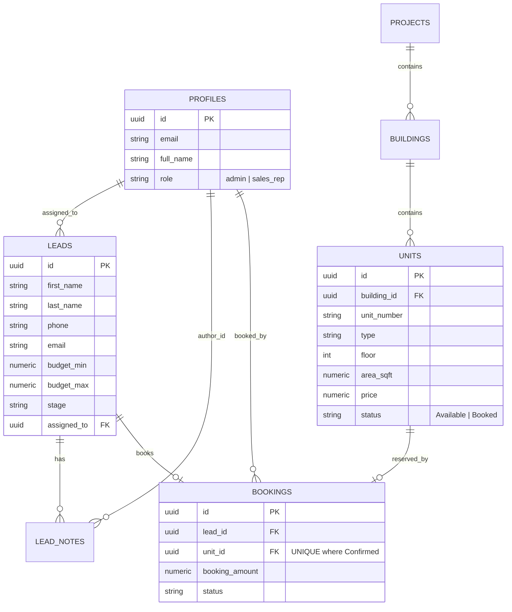

# EstateFlow — Enterprise Real Estate CRM

An end-to-end Real Estate CRM application engineered for sales teams to manage prospective buyers through a 7-stage pipeline, navigate hierarchical property inventories (Projects → Buildings → Units), and execute conflict-free unit bookings with **strict database-level concurrency protection** and **Role-Based Access Control (Admin vs. Sales Employee)**.

Built with **Next.js (App Router, TypeScript)** and **Supabase (PostgreSQL, Row-Level Security, RPC Transactions)**.

---

## 5 Important Architectural & Engineering Decisions

### 1. Atomic Concurrency Control with PostgreSQL Row-Level Locking (`FOR UPDATE`)
* **The Problem:** In high-velocity sales environments, two representatives can attempt to book the identical property unit simultaneously (e.g., during a launch event or after a weekend site visit). Relying solely on client-side state checks creates race conditions leading to illegal double-bookings.
* **Our Solution:** We implemented an atomic PostgreSQL Stored Procedure (`book_property_unit`) in `supabase/migrations/001_initial_schema.sql` that executes:
  ```sql
  SELECT status INTO v_unit_status FROM public.units WHERE id = p_unit_id FOR UPDATE;
  ```
  This immediately acquires a pessimistic row-level lock on the target unit. If another transaction reads the unit, it waits or is cleanly rejected if the status has transitioned from `Available`. In addition, a database-level partial unique index (`CREATE UNIQUE INDEX idx_unique_confirmed_unit_booking ON bookings (unit_id) WHERE status = 'Confirmed'`) acts as an unbreakable safety net.
* **Interactive Proof:** The application includes a built-in **"Simulate Concurrency Collision"** button that executes two simultaneous requests for the same unit in parallel, demonstrating that one succeeds while the second is safely blocked.

### 2. Dual-View Lead Pipeline (Kanban Board + Filterable Table)
* **The Decision:** Rather than restricting sales reps to either a simple table or a rigid board, EstateFlow provides a real-time toggle between an interactive **7-Stage Kanban Funnel** (`New` → `Contacted` → `Site Visit` → `Interested` → `Negotiation` → `Booked` → `Lost`) and an operational **Tabular View**.
* **Why:** Sales managers need tabular views for bulk sorting by budget, marketing source, and rep assignment; field sales reps need visual Kanban boards for rapid drag/click stage advancement during phone conversations.

### 3. Database-Enforced Role-Based Access Control (Supabase RLS)
* **The Decision:** Security is enforced directly at the database engine level via PostgreSQL Row Level Security (RLS) policies rather than solely in Next.js middleware or UI conditionals.
* **Why:** In real estate organizations, individual sales reps should only edit notes and advance deals for leads assigned to them, while Sales Directors/Admins have unrestricted global visibility. Even if an API route is queried directly, Postgres RLS blocks unauthorized alterations.

### 4. Hierarchical Property Inventory Model (`Projects` → `Buildings` → `Units`)
* **The Decision:** We structured real estate inventory into a 3-tier normalized relational model:
  - `projects`: Master developments (e.g., *The Grand Horizon*)
  - `buildings`: Individual towers or phases (e.g., *Tower A - Azure*, *Coral Tower*)
  - `units`: Specific sellable units with bedroom types (`1BHK`, `2BHK`, `3BHK`, `Penthouse`, `Villa`), floor number, area in sqft, and real-time availability.
* **Why:** Real estate developments rarely consist of isolated units; inventory matrices are organized by tower and floor plan. This structure enables floor-by-floor matrix navigation and price tiering.

### 5. Automated Lead Audit Trail & Integrated Follow-Up Scheduling
* **The Decision:** Any critical action—such as completing a booking, changing a deal stage, or recording client feedback—is automatically logged into `lead_notes` with a timestamp, author ID, and scheduled follow-up alert.
* **Why:** Real estate sales cycles often span several weeks or months. By displaying upcoming follow-up dates on the Executive Dashboard, sales reps avoid missing prospective buyers.

---

## Database Schema & Architecture



---

## Getting Started & Local Setup

### 1. Prerequisites
- **Node.js**: v18+ (tested on v24)
- **npm**: v9+

### 2. Installation
```bash
# Clone repository
git clone <your-repo-url>
cd realstate-crm

# Install dependencies
npm install
```

### 3. Configure Supabase (Optional for Live DB)
1. Create a project at [supabase.com](https://supabase.com).
2. Open your Supabase project's **SQL Editor** and execute:
   - `supabase/migrations/001_initial_schema.sql` (Creates tables, triggers, stored procedures & RLS policies)
   - `supabase/seed.sql` (Populates sample projects, towers, units, and leads)
3. Copy your project credentials into `.env.local`:
   ```bash
   cp .env.example .env.local
   ```
   Add your `NEXT_PUBLIC_SUPABASE_URL` and `NEXT_PUBLIC_SUPABASE_ANON_KEY`.

> **Note on Zero-Config Demo Mode:** If Supabase keys are not set, EstateFlow automatically runs on a built-in reactive local store seeded with realistic data and local concurrency checks. You can test all features right out of the box!

### 4. Run Locally
```bash
npm run dev
```
Open [http://localhost:3000](http://localhost:3000) in your browser.

---

## Testing Scenarios

1. **Lead Management & Notes**:
   - Go to `/leads` → Click **"Add Lead"** → Fill out contact info and budget.
   - Click on the lead → View details → Add a note with a follow-up date for tomorrow.
   - Go to `/` (Dashboard) → Verify the follow-up reminder appears in the **Scheduled Follow-ups** widget.
2. **Property Exploration & Booking**:
   - Go to `/properties` → Filter by Project (*The Grand Horizon*) or Unit Type (*3BHK*).
   - Click **"Book Unit"** on unit `A-401` → Select a lead → Enter deposit amount → Confirm.
   - Notice the unit badge instantly switches to **"Booked"** and the lead transitions to **"Booked"** stage.
   - Go to `/bookings` → Confirm the transaction audit record is registered.
3. **Double-Booking Concurrency Test**:
   - Click the **"Concurrency Test"** button in the header or on `/properties`.
   - Click **"Simulate Concurrent Collision"** to watch two agents submit booking requests simultaneously for the same unit.
   - Verify that one transaction is secured while the second is safely blocked.
4. **Role Switching (RBAC)**:
   - Use the top-right avatar menu to switch between **Admin** (`Sarah Connor`) and **Sales Rep** (`John Doe`).
